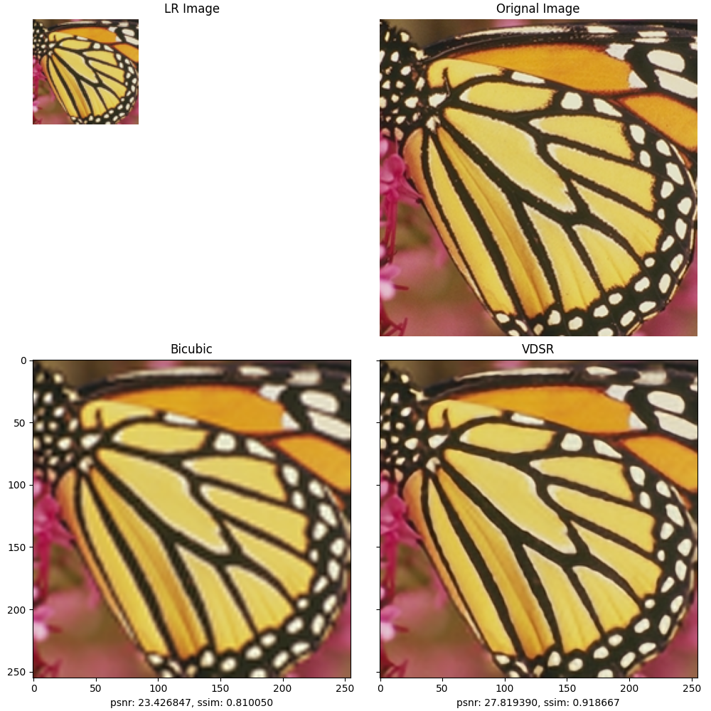
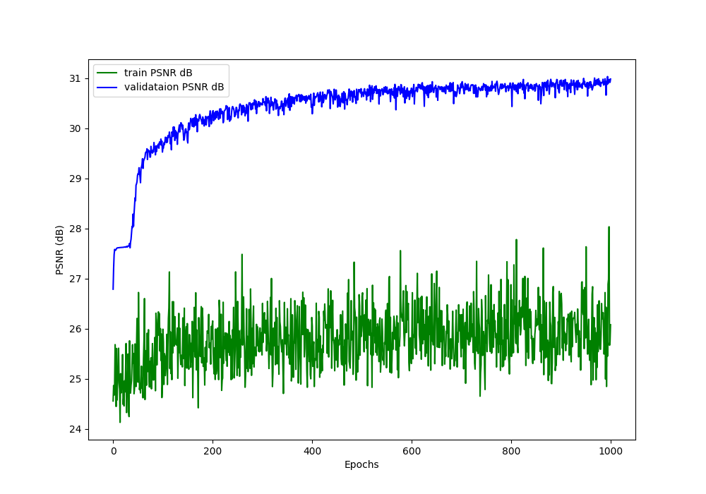

# Super-resolution

This is a master's thesis project
By Damian Łysomirski

What is super resolution ? 
Super-resolution is the task of constructing a higher-resolution image from a lower-resolution image.
While this task has traditionally been approached with non-neural methods such as bilinear and bicubic upsampling,
neural networks offer an opportunity for significant improvements.

Neural netoworks currently implemented for SR:
- SRCNN 
- VDSR
- ESPCN 

## Example of usage

For training from start:
python train.py -m "SRCNN" -s 3 -e 3 -t "training_from_the_beginning"


To continue training from checkpoint:
python train.py -m "SRCNN" -s 3 -e 3 -t "training_from_checkpoint" -p "./checkpoints_new/SRCNN_sf_3_epoch_3.pt"

To test:
python test.py -m "ESPCN" -s 3 -p "./checkpoints_new/ESPCN_sf_3_epoch_100.pt"


## Downloading and instalation
```
# Clone repo
git clone 
cd comparison-of-rendering-methods 

# Creating virtual environment
python -m venv venv 

#Avtivation on linux
source ./venv/bin/activate

#Activation od windows CMD
.\venv\Scripts\activate

#Deactive on windows CMD
.\venv\Scripts\deactivate

# Installing requirements
pip install -r requirements.txt
``` 

## Results of VDSR 1000 epoch training


