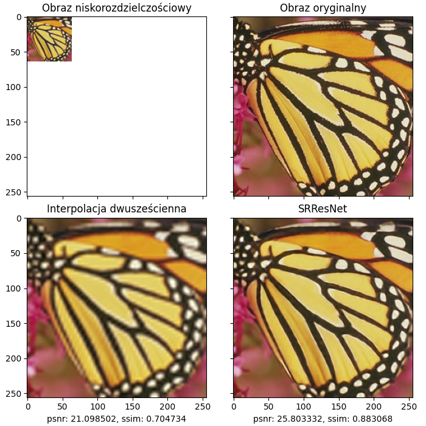
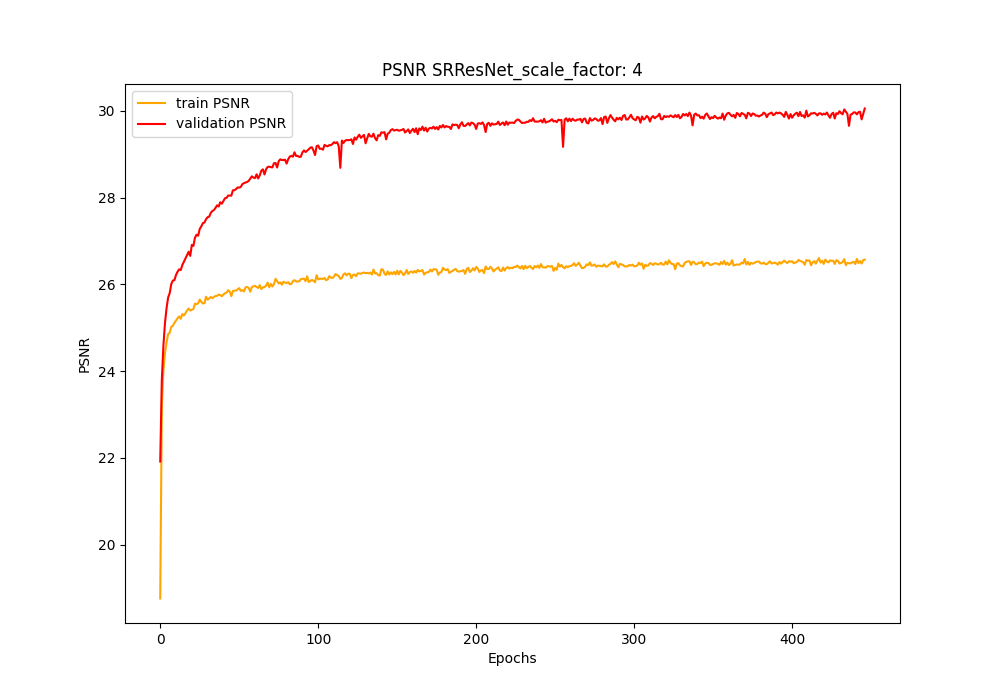

# Super-resolution

This is a master's thesis project
By Damian Łysomirski

Abstract:
The rapid development of digital technologies observed in recent years has led to a demand for high-resolution images. Blurry, smeared images with a low pixel count become unpleasant to the eye. Improving image resolution, also known as super-resolution, is a technique for generating high-resolution images from low-resolution counterparts in a way that achieves a clear, sharp image with more pixels, without visible distortions. To achieve this, both classic interpolation methods and deep learning techniques are used. The aim of this study is to apply deep neural networks to improve image resolution. In the course of the study, neural network models used in the field were reviewed, and four of them were implemented. A program was created that enabled the implementation of the SRCNN, ESPCN, VDSR, SRResNet models. The models were trained on the created DIV2Ks dataset and then tested in a uniform testing environment. The results obtained for each model were compared in terms of quality, efficiency, and the ability to adjust the scaling factor, as well as compared with classic image resolution improvement methods (interpolation methods). The final aspect of the study is the analysis of the results obtained and consideration of future development directions.

## Downloading and instalation
Clone repo
```
$ git clone https://github.com/Damianlysomirski/Super-resolution.git
$ cd Super-resolution
```
Creating virtual environment
```
$ python -m venv venv 
```
Activation on linux
```
$ source ./venv/bin/activate
```
Activation od windows CMD
```
$ .\venv\Scripts\activate
```
Installing requirements
```
$ pip install -r requirements.txt
```
Deactive on windows CMD
```
$ .\venv\Scripts\deactivate
``` 

## Example of usage

### For training from start use:
``` 
python train.py -m "<model_name>" -s <scale_factor> -e <epochs> -t "training_from_the_beginning"
``` 
Example: 
``` 
python train.py -m "SRCNN" -s 4 -e 30000 -t "training_from_the_beginning"
``` 
To continue training from checkpoint:
``` 
python train.py -m "<model_name>" -s <scale_factor> -e <epochs> -t "training_from_checkpoint" -p "<path>
``` 
Example:
``` 
python train.py -m "SRCNN" -s 3 -e 3000 -t "training_from_checkpoint" -p "./checkpoints_new/SRCNN_sf_3_DIV2Ks/
```
### To test all
To predict output for small input imagel, for all trained models: SRCNN, ESPCN, VDSR, SRResNet, Bicubic, for given scale use command:

``` 
python test_all.py -s <scale> -input <input_image>
``` 

The results are saved in folder results_all.

Example:
``` 
python test_all.py -s 3 -input "./resources/BSDS200/24004.png"
```

### To test single:
``` 
python test.py -m "<model_name>" -s <scale> -p <path>
``` 

Scale factor 2:
``` 
python test.py -m "SRCNN" -s 2 -p "./checkpoints_new/SRCNN_sf_2_DIV2Ks/SRCNN_sf_2_epoch_974_DIV2K_s.pt"
python test.py -m "ESPCN" -s 2 -p "./checkpoints_new/ESPCN_sf_2_DIV2Ks/ESPCN_sf_2_epoch_652_DIV2K_s.pt"
python test.py -m "VDSR" -s 2 -p "./checkpoints_new/VDSR_sf_2_DIV2Ks/VDSR_sf_2_epoch_244_DIV2K_s.pt"
python test.py -m "SRResNet" -s 2 -p "./checkpoints_new/SRResNet_sf_2_DIV2Ks/SRResNet_sf_2_epoch_600_DIV2K_s.pt
``` 
Scale factor 3:
``` 
python test.py -m "SRCNN" -s 3 -p "./checkpoints_new/SRCNN_sf_3_DIV2Ks/SRCNN_sf_3_epoch_839_DIV2K_s.pt"
python test.py -m "ESPCN" -s 3 -p "./checkpoints_new/ESPCN_sf_3_DIV2Ks/ESPCN_sf_3_epoch_792_DIV2K_s.pt"
python test.py -m "VDSR" -s 3 -p "./checkpoints_new/VDSR_sf_3_DIV2Ks/VDSR_sf_3_epoch_132_DIV2K_s.pt"
python test.py -m "SRResNet" -s 3 -p "./checkpoints_new/SRResNet_sf_3_DIV2Ks/SRResNet_sf_3_epoch_530_DIV2K_s.pt"
``` 
Scale factor 4:
``` 
python test.py -m "SRCNN" -s 4 -p "./checkpoints_new/SRCNN_sf_4_DIV2Ks/SRCNN_sf_4_epoch_766_DIV2K_s.pt"
python test.py -m "ESPCN" -s 4 -p "./checkpoints_new/ESPCN_sf_4_DIV2Ks/ESPCN_sf_4_epoch_679_DIV2K_s.pt"
python test.py -m "VDSR" -s 4 -p "./checkpoints_new/VDSR_sf_4_DIV2Ks/VDSR_sf_4_epoch_96_DIV2K_s.pt"
python test.py -m "SRResNet" -s 4 -p "./checkpoints_new/SRResNet_sf_4_DIV2Ks/SRResNet_sf_4_epoch_446_DIV2K_s.pt"
``` 


## Results
To test you need to used previously trained model, after using test.py, 
there will be printed statistics for Set5 and Set14, and results for example image.
All results are saved in results folder, for latests used model.

### Comparision 3 images:


### Comparision 4 images:


### PSNR plot:


## Predict
The test command also provides predictions for the given input image (without reference to the original).
It is saved as predict.png

### Low-resolution:


### High-resolution:


## Additional informations
Repository do not contain DIV2Ks dataset, contain onyl Dataset's for testing: Set5, Set15, BSDS200
For training please remember to install cuda:
https://developer.nvidia.com/cuda-downloads 

